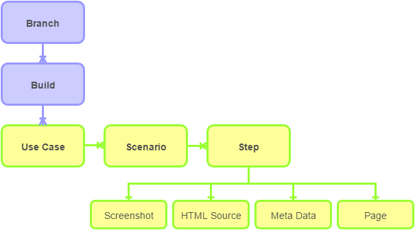

# Scenarioo Format Specification

This is the specification of the Scenarioo documentation format. To find out more about Scenarioo please visit [www.scenarioo.org](http://www.scenarioo.org).

WARNING: This file format is not used in current versions of Scenarioo 2.x. It is the future format for Scenarioo 3.x. For a reference of the Scenarioo 2.x format, please have a look in our [Wiki](https://github.com/scenarioo/scenarioo/wiki/Scenarioo-Writer-Documentation-Format).


## Domain model




## General rules

* Whenever we talk about URL encoding here, we use the `+` sign to encode a space character instead of `%20`.
* For a description of the JSON format, see http://json.org
* [Labels](Labels) -> TODO: Specify here


## Field types

### <a name="string">String</a>

A regular string as defined by the JSON format.

### <a name="string_identifier">String (identifier)</a>

All fields that are used as identifiers and therefore can be part of a URL have this type. It is a standard JSON string except that the two characters `/` and `\` are not allowed. `\` as an escape character is allowed.

### <a name="details">Details</a>

A JSON object with no restriction. Two special variants of this type are treated specially be Scenarioo.

* If any JSON object inside the details field has a `type` and `name` field but no `details` field, it is considered an *Scenarioo object reference*.
* If any JSON object inside the details field has a `type`, `name` and a `details` field, it is considered a *Scenarioo object".

TODO: Link to the page where the object repository feature is described in detail
TODO: Is the absence of the `details` field good enough to distinguish between object references and object details?

### <a name="labels">Labels</a>

The value of a labels field is an array of strings. Each string has to satisfy the regular expression `^[ a-zA-Z0-9_-]+$`.

### <a name="labels">Date</a>

TODO: Define Date format.


## File System Structure

TODO: Draw a new diagram using draw.io, also commit the draw.io source of the diagram as well as the png image.

Scenarioo documentation data is stored in a certain structure of folders and files. The image below illustrates this. The folder structure reflects the domain model of Scenarioo (see previous chapter).


## Files and Folders

### Documentation Root Folder

This is the folder where all the Scenarioo documentation files and folders are stored. Typically it contains a number of branch folders.


### Branch Folder and branch.json

#### Purpose

Scenarioo allows to document several branches of your applications. You can use this to document co-existing branches and also to document different versions of your software. We reccommend to document each version of your application as a separate branch in Scenarioo.

#### Rules

* A folder in the *documentation root* is a *branch folder* if and only if it also contains a valid `branch.json` file.
* The folder name of a *branch folder* must be the URL encoded version of the `name` value in the `branch.json`. If this is not the case, the folder is not considered a *branch folder*. 
* It is allowed to have other folders that are not *branch folders* in the *documentation root*. They are ignored by Scenarioo.

#### Fields

Name | Type | Description
:---|:---|:---
name        | <a href="#string_identifier">String (identifier)</a>  | **Required.** Use something that identifies your branch or your software version, e.g. "Release 2014-10-25", "Version 3.1", "trunk" or "123-some-super-new-feature".
description | <a href="#string">String</a>  | A short description of the purpose of this branch, what version of your application does this branch contain or document.
details     | <a href="#details">Details</a> | Whatever additional information you would like to attach to the branch object.

#### Example branch.json file

```
{
	"name" : "develop branch",
	"description" : "Here we integrate all the cool features for the next release.",
	"details" : {
		"branch creation date" : "...",
		"authors" : [
			"homer", "marge", "bart", "lisa", "maggie"
		]
	}
}
```


### Build Folder and build.json

#### Purpose

You probably want to run a regular build for generating the documentation data. For this purpose, each branch is structured in a number of builds. Each run of all your tests and a belonging fully generated scenarioo documentation of your application is called a *build*.

#### Rules

* A *build folder* is a folder inside a *branch folder* if and only if it contains a valid `build.json` file.
* The folder name of a *build folder* must be the URL encoded version of the `name` value in the `build.json`. If this is not the case, the folder is not considered a *build folder*. 
* It is allowed to have other folders that are not *build folders* in a *branch folder*. They are ignored by Scenarioo.

#### Fields

Name | Type | Description
:---|:---|:---
name        | <a href="#string_identifier">String (identifier)</a> | **Required.** Use something that reflects the uniqueness and order of your builds, e.g. the timestamp or a build sequence number.
date        | <a href="#date">Date</a>    | Start date / time of the build (as a timestamp) --> TODO: Specify exact format
revision    | <a href="#string">String</a>  | the revision number in your version control system (e.g. changeset number).
status      | <a href="#string">String</a>  | Whether the build was a `success` or `failed`. If the status is left empty, Scenarioo will calculate it from the states of contained use cases and their scenarios. Scenarioo by default (if not configured otherwise) only supports "failed" and "success" as known status values. All other status values are treated as not successful and displayed in orange.
details     | <a href="#details">Details</a> | Whatever additional information you would like to attach to the build object.


#### Example build.json file

```
{
	"name" : "2014-01-20",
	"revision" : "1290FE2",
	"date" : "2014-01-20T00:00:00+01:00",
	"status" : "success",
	"details" {
		"build trigger" : "manual",
		"build run duration" : "14 minutes"
	}
}
```


#### Use Case Folder and usecase.json

TODO: Add specification

#### Fields

Name | Type | Description
:---|:---|:---
name        | <a href="#string_identifier">String (identifier)</a>  | **Required.** Name for the use case.
description | <a href="#string">String</a>  | A longer description to describe the use case.
status      | <a href="#string">String</a>  | Whether the use case was a `success` or `failed`. If the status is left empty, Scenarioo will calculate it from the states of contained scenarios. Scenarioo by default (if not configured otherwise) only supports "failed" and "success" as known status values. All other status values are treated as not successful and displayed in orange.
details     | <a href="#details">Details</a> | Whatever additional information you would like to attach to the usecase object.


#### Scenario Folder and scenario.json

TODO: Add specification

#### Fields

Name | Type | Description
---|:---:|---
name        | <a href="#string_identifier">String (identifier)</a>  | **Required.** Name for the scenario.
description | <a href="#string">String</a>  | A longer description to describe the scenario.
status      | <a href="#string">String</a>  | Whether the scenario is a `success` or `failed`. Scenarioo by default (if not configured otherwise) only supports "failed" and "success" as known status values. All other status values are treated as not successful and displayed in orange.
details     | <a href="#details">Details</a> | Whatever additional information you would like to attach to the usecase object.


#### Steps of a scenarioo and <stepnumber>.json

TODO: Add specification

#### Fields

Name | Type | Description
---|:---:|---
page        | <a href="#">Page</a>  | Page Information
screenAnnotation | [<a href="#">Screen Annotation</a>] | A screen annotation object.

